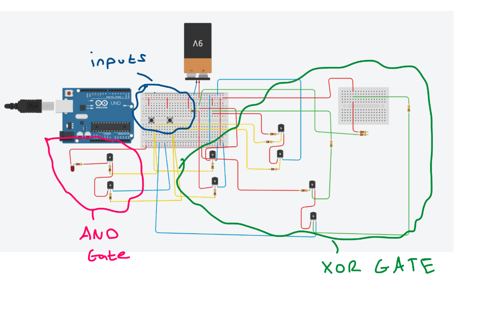

# Transistor-Half-Adder

# Introduction
This repository describes the design and construction of a circuit that displays the sum of single-digit binary bits. This circuit was to be constructed without the use of integrated circuits; instead, discrete transistors were to be used, which increases the complexity of this project. The sum of two bits requires two outputs: the sum and the carry. Boolean Algebra and De Morgan's laws were used to determine that an XOR gate was needed for the sum and an AND gate was needed for the carry.

The circuit was constructed with NPN bipolar-junction transistors; these devices have three terminals: the base, the emitter, and the collector. The general working principle is that a small current applied to the base causes a larger current to flow from the collector to the emitter; hence, the transistor acts as an amplifier and a switch. The NPN refers to a transistor consisting of two types of semiconductors: in an n-type semiconductor, the majority charge carriers are electrons. In contrast, in a p-type semiconductor, they are positive holes. The construction of the AND gate simply involves pairing two NPN transistors in series; a red LED acts as the output for the carry. As the proof above shows, the XOR gate requires a NAND, OR, and another AND gate. The NAND gate requires adding an inverter pull-up at the end of an AND gate; the OR gate requires adding two transistors in parallel instead of in series. A green LED was used as the output node for the sum. Using discrete transistors was crucial here as it teaches digital logic and electrical switching skills. Troubleshooting with a multimeter was also very important for this project.

# Circuit Diagram (Note that the microcontroller is only used as a power source in the demo video)

# Demonstration Video

# Components List
1. Power Source (Around 3V to 9V is suitable)
2. Resistors of values 10k, 1k, and 15k
3. 8 NPN bipolar-junction transistors
4. 2 Switch buttons
5. Multimeter for troubleshooting
6. Breadboard
7. LED's of at least two different colours

# Common Issues
1. Outputs in the XOR gate may be weak due to the amount of stagees, this can be fixed by either adding a buffer transistor to amplify or to change the values of the resistors that feed the base
2. Loose wires
3. Switch buttons the wrong way round
   

   

